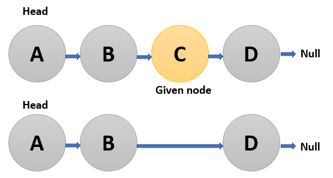

## Problem Domain:

function to delete a node in a singly-linked list, You will not be given access to the head of the list, instead you will be given access to the node to be deleted directly.

**Input:** linkedlist, node value
**Output :** linked list after delete node value.

## Test Cases:

| linkedlist  | node  | after delete |
| ------------- | ------------- | ------------- |
| ["A","B","C","D"]  | "C"  | ['A', 'B', 'D'] |
| ["A","B","C","D"]  | "A"  | ["B" ,"C", "D"] |

## Visualization:

## Algorithm:

- create linked list class and push node value inside it.

- create node class to take node value to deleted from linked list.

- create delete functhon to delete specific node 

- create method to return a linkedlist after delete node from it.

## Big O:

I want to put one node value Space complexity : O(1) and the time is constant Time complexity: O(1)

## Code (Python): 

def deletenode(node):
    '''function to delete a node in a singly-linked list.'''

    next_node=node.next
    node.value  = next_node.value
    node.next = next_node.next
    next_node.next=None
    del(next_node)

## Step Through:

