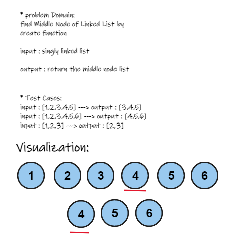

## problem Domain:

find Middle Node of Linked List by create function

  - **input** : singly linked list

  - **output** : return the middle node list

## Test Cases:

  - input : [1,2,3,4,5] ---> output : [3,4,5]
  - input : [1,2,3,4,5,6] ---> output : [4,5,6]
  - input : [1,2,3] ---> output : [2,3]

## Visualization: 

