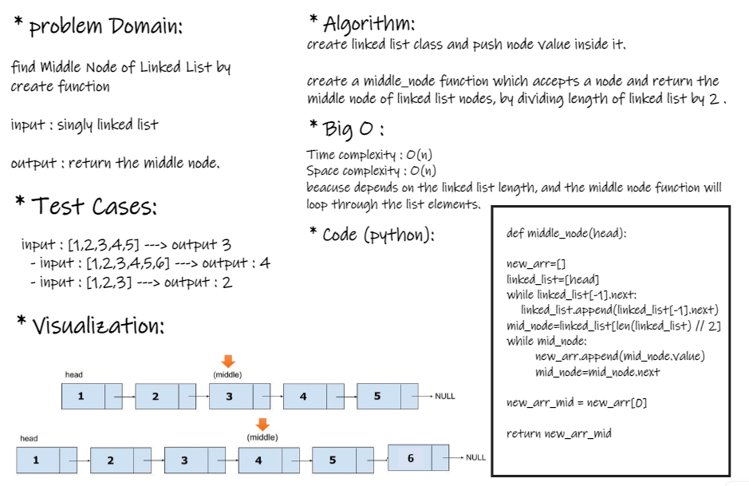
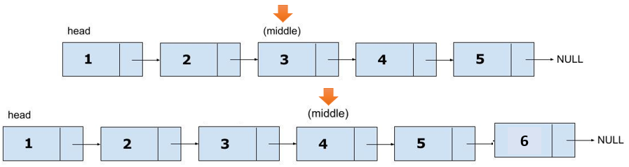

## problem Domain:

find Middle Node of Linked List by create function

  - **input** : singly linked list

  - **output** : return the middle node

## Test Cases:

  - input : [1,2,3,4,5] ---> output 3
  - input : [1,2,3,4,5,6] ---> output : 4
  - input : [1,2,3] ---> output : 2

## Visualization: 

## Algorithm:

- create linked list class and push node value inside it.

- create a middle_node function which accepts a node and return the middle node of linked list nodes, by dividing length of linked list by 2 .

## Big O :

Time complexity : O(n)

Space complexity : O(n)

beacuse depends on the linked list length, and the middle node function will loop through the list elements.

## Code (python):

 def middle_node(head):
    '''find Middle Node of Linked List'''

    new_arr=[]
    linked_list=[head]
    while linked_list[-1].next:
        linked_list.append(linked_list[-1].next)
    mid_node=linked_list[len(linked_list) // 2]
    while mid_node:
            new_arr.append(mid_node.value)
            mid_node=mid_node.next

    new_arr_mid = new_arr[0]

    return new_arr_mid