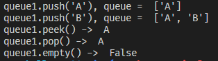

## Stack and Queue - Challenge01

### Implement Queue Using Stack

### Problem Domain:

Implement a first in first out (FIFO) queue using two stacks. which queue should support all the functions of a normal queue (push, peek , pop, and empty).

  - input:  elements and performing some operations on them
  - output: Queue

### Test Cases:

| input  | output |
| ------------- | ------------- |
| queue1.push("A")  | queue =  ['A']  |
| queue_1.push("B")  | queue =  ['A', 'B']  |
| queue1.peek()   | return A  |
| queue1.pop()   | return A  |
| queue1.empty()   | False  |

### Visualization:

### Algorithm:

  - Implement the class

  - create push() method to Pushes element x to the back of the queue.

  - create pop() method to Removes the element from the front of the queue and returns it.

  - create peek() method to Returns the element at the front of the queue.

  - create empty() method to check if the queue is empty.

  - test all method.

### Big O: 

the all method depends on the Num. of queue element, and the code have **for loop** on pop() method pass through the elements, then the **Time complexity = O(n)** , and **Space complexity= O(n)**

### Code (Python):

class MyQueue:

  
    def __init__(self) -> None:
       self.queue = []
       self.size=0

    
    def push(self,element):
        '''
        Pushes element x to the back of the queue.
        '''

        self.queue.append(element)
        self.size +=1
        return self.queue

    def pop(self):

        '''
        Removes the element from the front of the queue and returns it.
        '''

        stack_1=self.queue
        stack_2=[]

        for i in range(len(stack_1)):
            
            stack_2.append(stack_1.pop())
        remove_member=stack_2.pop()

        for i in range(len(stack_2)-1,-1,-1):
            self.queue.append(stack_2[i])
            
        return remove_member

    def peek(self):
        '''
        Returns the element at the front of the queue. 
        '''

        
        return self.queue[0]
        

    def empty(self):

        '''
        Returns true if the queue is empty, false otherwise.
        '''

        if len(self.queue)>0:
            return False
        else:
            return True

