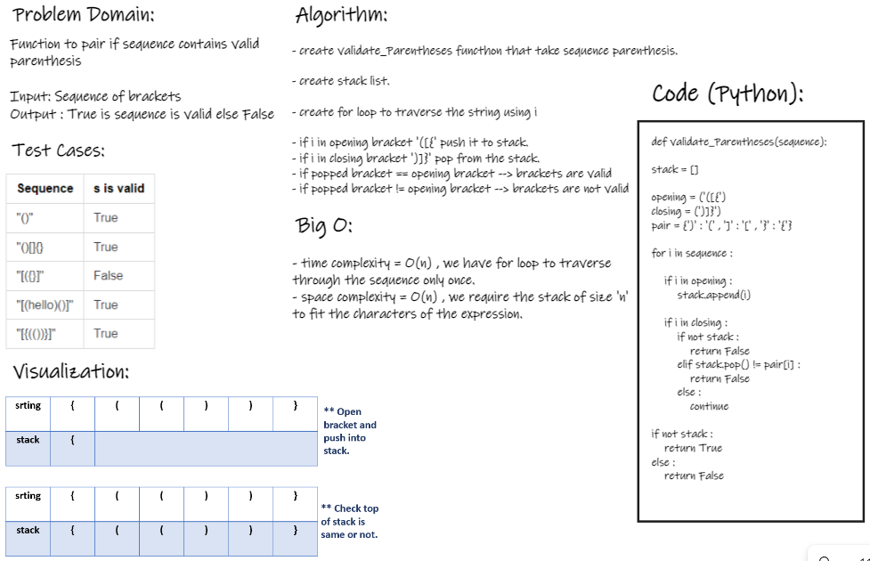
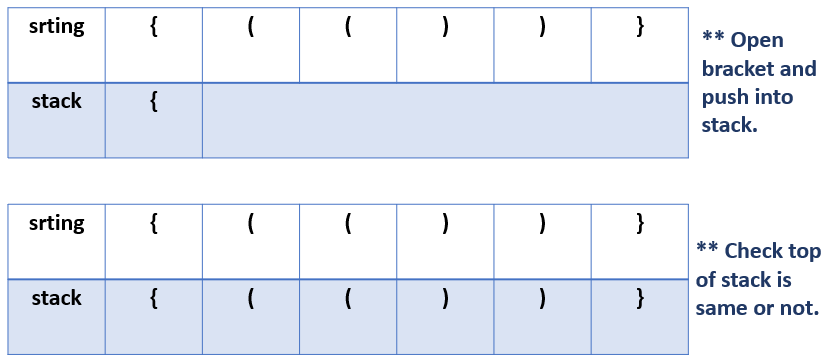

## Problem Domain:

Function to pair if sequence contains valid parenthesis

**Input:** Sequence of brackets
**Output :** True is sequence is valid else False

## Test Cases:

| Sequence  | s is valid  | 
| ------------- | ------------- | 
| "()"  | True  | 
| "()[]{}  | True  |
| "[({}]"  | False  |
| "[(hello)()]"  | True  |
| "[{(())}]"  | True  |

## Visualization:

## Algorithm:

- create validate_Parentheses functhon that take sequence parenthesis.

- create stack list.

- create for loop to traverse the string using i

   -  if i in opening bracket '([{' push it to stack.
   -  if i in closing bracket ')]}' pop from the stack.
      - if popped bracket == opening bracket --> brackets are valid 
      - if popped bracket != opening bracket --> brackets are not valid

 
## Big O:

time complexity = O(n) , we have for loop to traverse through the sequence only once.
space complexity = O(n) , we require the stack of size 'n' to fit the characters of the expression.

## Code (Python): 

def validate_Parentheses(sequence):

    stack = []

    opening = ('([{')
    closing = (')]}')
    pair = {')' : '(' , ']' : '[' , '}' : '{'}

    for i in sequence :

        if i in opening :
            stack.append(i)
            
        if i in closing :
            if not stack :
                return False
            elif stack.pop() != pair[i] :
                return False
            else :
                continue
            
    if not stack :
        return True
    else :
        return False
